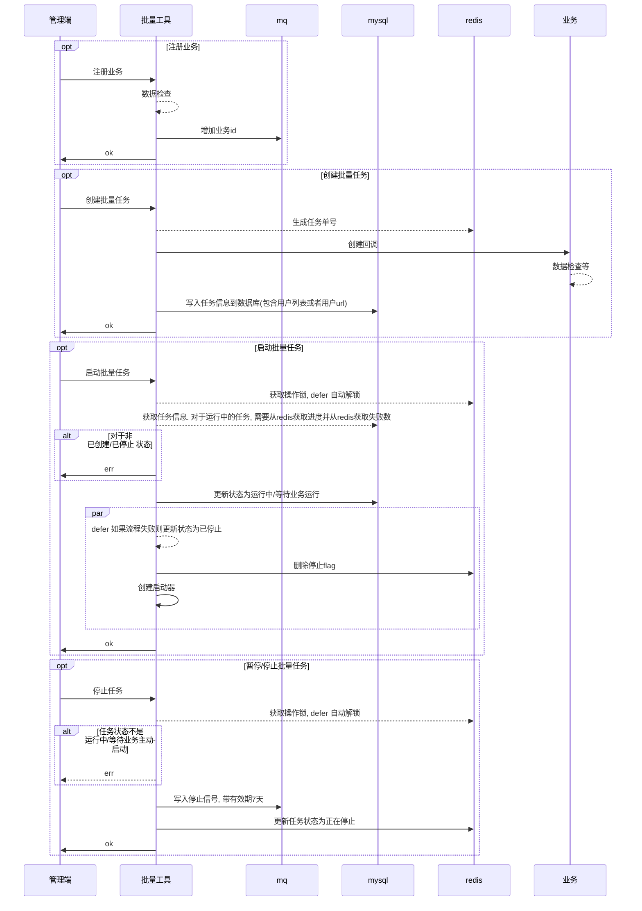
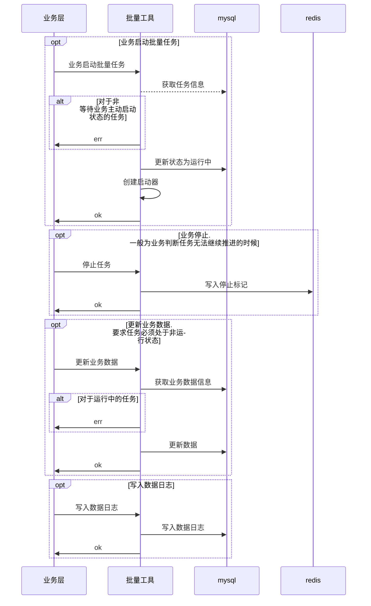
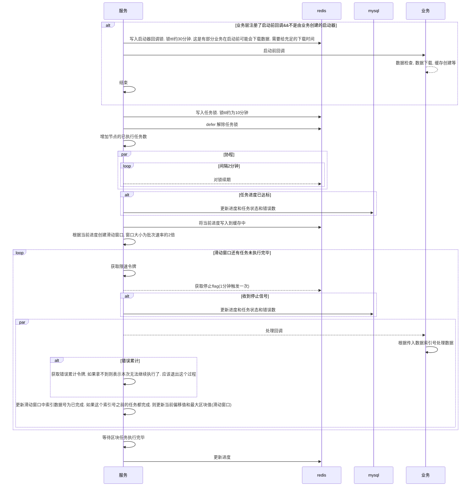
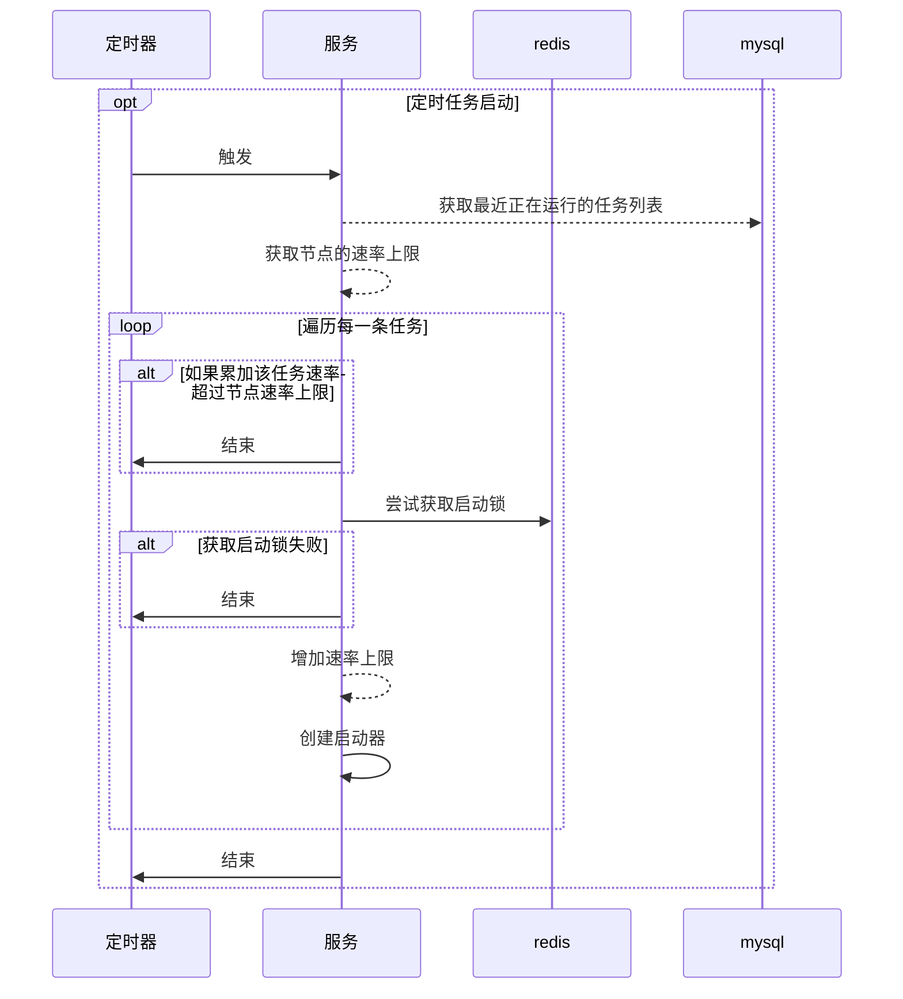
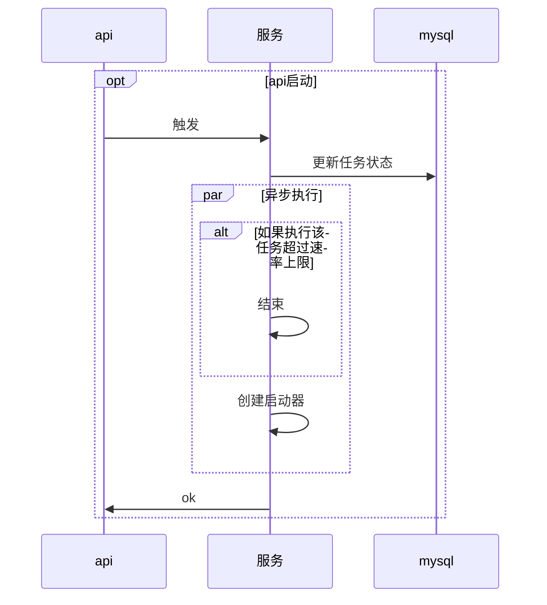

<!-- TOC -->

- [任务处理流程](#%E4%BB%BB%E5%8A%A1%E5%A4%84%E7%90%86%E6%B5%81%E7%A8%8B)
    - [管理端控制](#%E7%AE%A1%E7%90%86%E7%AB%AF%E6%8E%A7%E5%88%B6)
    - [业务控制](#%E4%B8%9A%E5%8A%A1%E6%8E%A7%E5%88%B6)
- [启动器](#%E5%90%AF%E5%8A%A8%E5%99%A8)
- [自动恢复运行](#%E8%87%AA%E5%8A%A8%E6%81%A2%E5%A4%8D%E8%BF%90%E8%A1%8C)
    - [管理端/接口调用启动](#%E7%AE%A1%E7%90%86%E7%AB%AF%E6%8E%A5%E5%8F%A3%E8%B0%83%E7%94%A8%E5%90%AF%E5%8A%A8)
    - [启动器上限](#%E5%90%AF%E5%8A%A8%E5%99%A8%E4%B8%8A%E9%99%90)
- [如何并行执行任务数据处理](#%E5%A6%82%E4%BD%95%E5%B9%B6%E8%A1%8C%E6%89%A7%E8%A1%8C%E4%BB%BB%E5%8A%A1%E6%95%B0%E6%8D%AE%E5%A4%84%E7%90%86)
    - [仅储存任务进度. 之后的数据通过滑动窗口取出批次数据并行扔给业务处理, 滑动窗口起点表示之前的所有数据都处理完毕, 定时同步滑动窗口进度](#%E4%BB%85%E5%82%A8%E5%AD%98%E4%BB%BB%E5%8A%A1%E8%BF%9B%E5%BA%A6-%E4%B9%8B%E5%90%8E%E7%9A%84%E6%95%B0%E6%8D%AE%E9%80%9A%E8%BF%87%E6%BB%91%E5%8A%A8%E7%AA%97%E5%8F%A3%E5%8F%96%E5%87%BA%E6%89%B9%E6%AC%A1%E6%95%B0%E6%8D%AE%E5%B9%B6%E8%A1%8C%E6%89%94%E7%BB%99%E4%B8%9A%E5%8A%A1%E5%A4%84%E7%90%86-%E6%BB%91%E5%8A%A8%E7%AA%97%E5%8F%A3%E8%B5%B7%E7%82%B9%E8%A1%A8%E7%A4%BA%E4%B9%8B%E5%89%8D%E7%9A%84%E6%89%80%E6%9C%89%E6%95%B0%E6%8D%AE%E9%83%BD%E5%A4%84%E7%90%86%E5%AE%8C%E6%AF%95-%E5%AE%9A%E6%97%B6%E5%90%8C%E6%AD%A5%E6%BB%91%E5%8A%A8%E7%AA%97%E5%8F%A3%E8%BF%9B%E5%BA%A6)
    - [一些被弃用的方案](#%E4%B8%80%E4%BA%9B%E8%A2%AB%E5%BC%83%E7%94%A8%E7%9A%84%E6%96%B9%E6%A1%88)
        - [仅储存进度. 串行化执行, 让业务控制并发量. 业务主动告知平台本次处理完成了多少任务量](#%E4%BB%85%E5%82%A8%E5%AD%98%E8%BF%9B%E5%BA%A6-%E4%B8%B2%E8%A1%8C%E5%8C%96%E6%89%A7%E8%A1%8C-%E8%AE%A9%E4%B8%9A%E5%8A%A1%E6%8E%A7%E5%88%B6%E5%B9%B6%E5%8F%91%E9%87%8F-%E4%B8%9A%E5%8A%A1%E4%B8%BB%E5%8A%A8%E5%91%8A%E7%9F%A5%E5%B9%B3%E5%8F%B0%E6%9C%AC%E6%AC%A1%E5%A4%84%E7%90%86%E5%AE%8C%E6%88%90%E4%BA%86%E5%A4%9A%E5%B0%91%E4%BB%BB%E5%8A%A1%E9%87%8F)
        - [将每个数据扔给mq, 让mq来并行消费调用业务处理](#%E5%B0%86%E6%AF%8F%E4%B8%AA%E6%95%B0%E6%8D%AE%E6%89%94%E7%BB%99mq-%E8%AE%A9mq%E6%9D%A5%E5%B9%B6%E8%A1%8C%E6%B6%88%E8%B4%B9%E8%B0%83%E7%94%A8%E4%B8%9A%E5%8A%A1%E5%A4%84%E7%90%86)
        - [使用bit位来表示一条数据是否完成, 将bit数据放入redis中](#%E4%BD%BF%E7%94%A8bit%E4%BD%8D%E6%9D%A5%E8%A1%A8%E7%A4%BA%E4%B8%80%E6%9D%A1%E6%95%B0%E6%8D%AE%E6%98%AF%E5%90%A6%E5%AE%8C%E6%88%90-%E5%B0%86bit%E6%95%B0%E6%8D%AE%E6%94%BE%E5%85%A5redis%E4%B8%AD)
        - [将bit位存放在服务本地内存, 定时刷新到redis](#%E5%B0%86bit%E4%BD%8D%E5%AD%98%E6%94%BE%E5%9C%A8%E6%9C%8D%E5%8A%A1%E6%9C%AC%E5%9C%B0%E5%86%85%E5%AD%98-%E5%AE%9A%E6%97%B6%E5%88%B7%E6%96%B0%E5%88%B0redis)
        - [仅储存任务进度, 将一段数据作为一批次数据, 只有这一批次数据全部执行完毕才会更新进度](#%E4%BB%85%E5%82%A8%E5%AD%98%E4%BB%BB%E5%8A%A1%E8%BF%9B%E5%BA%A6-%E5%B0%86%E4%B8%80%E6%AE%B5%E6%95%B0%E6%8D%AE%E4%BD%9C%E4%B8%BA%E4%B8%80%E6%89%B9%E6%AC%A1%E6%95%B0%E6%8D%AE-%E5%8F%AA%E6%9C%89%E8%BF%99%E4%B8%80%E6%89%B9%E6%AC%A1%E6%95%B0%E6%8D%AE%E5%85%A8%E9%83%A8%E6%89%A7%E8%A1%8C%E5%AE%8C%E6%AF%95%E6%89%8D%E4%BC%9A%E6%9B%B4%E6%96%B0%E8%BF%9B%E5%BA%A6)

<!-- /TOC -->
---

# 任务处理流程

## 管理端控制

## 业务控制

---

# 启动器

在管理端和程序启动时会创建一个启动器.

启动器创建后会获取任务执行锁. 锁ttl一般为5分钟. 如果获取成功, 则每隔 ttl*1/3 时间为锁续期.

启动器成功创建时会增加当前节点的任务执行数

---

# 自动恢复运行

启动器执行过程中, 可能由于服务器宕机/业务层处理无法进行等原因异常. 我们需要在启动器停止一段时间后自动恢复执行.

这里使用定时器扫描所有运行中的任务, 如果没有超过速率上限, 则对运行中的任务触发启动创建一个任务启动器.

仅扫描配置时间内创建的任务, 比如一个月, 创建时间超过一个月的任务则不会主动恢复. 必须主动点击运行以激活.

## 管理端/接口调用启动

直接触发启动创建一个任务启动器

## 启动器上限

提供最大速率上限配置, 当前执行的所有任务速率总和不允许超过这个上限. 包括主动执行也不允许让当前节点超过这个速率上限.

---

# 如何并行执行任务数据处理

## 仅储存任务进度. 之后的数据通过滑动窗口取出批次数据并行扔给业务处理, 滑动窗口起点表示之前的所有数据都处理完毕, 定时同步滑动窗口进度

优点, 对于进度的储存占用空间忽略不计, 更新io耗时降低为O(1). 且进度同步是间隔的而不是每次更新就同步. 进一步降低io消耗. 业务的并行执行速度得到最大的发挥. 一批次中的一条任务执行完毕后会立即进行下一条处理, 业务节点的性能得到大幅释放, 且消费速率曲线稳定. 速率由批量任务平台精确控制, 业务层无需考虑并行/速率的实现, 只需要考虑对单条数据的处理.

缺点. 滑动窗口一般为业务并行处理速率的n倍, 一旦批量任务平台执行该任务的节点异常丢失节点. 最复杂的情况下需要重跑整个滑动窗口长度的数据量.

滑动窗口实现原理转到[这里](https://github.com/zlyuancn/sliding_window)

## 一些被弃用的方案

### 仅储存进度. 串行化执行, 让业务控制并发量. 业务主动告知平台本次处理完成了多少任务量

优点. 业务对进度和并发自主可控

缺点. 业务想要并行执行需要自行实现, 处理速率也需要业务实现, 业务需要主动报告, 平台对任务的速率无法控制.

### 将每个数据扔给mq, 让mq来并行消费调用业务处理

增加了一个新的mq系统. 业务会变得更加复杂. 且, 数据扔给mq会导致数据膨胀, 比如将索引1的数据扔给mq, 除了数据本身之外, mq的系统会为这个数据增加一些mq系统独有的内容来支撑mq运行. 而且增加了对mq的io消耗. 如果数据量非常大则产生非常高的mq系统费用.

### 使用bit位来表示一条数据是否完成, 将bit数据放入redis中

这里通过扫描bit位拿到未完成的一批次数据, 循环产生协程调用业务处理. 处理完成的任务更新bit位.

缺点. 对于100亿数据. 会占用 1.16GB的bit数据来表示. 对redis来说比较高了. 且扫描redis中的为0或1的bit位耗时为O(N)

### 将bit位存放在服务本地内存, 定时刷新到redis

缺点. 100亿数据每次同步bit位会写入1.16GB数据, 对redis负担巨大

### 仅储存任务进度, 将一段数据作为一批次数据, 只有这一批次数据全部执行完毕才会更新进度

优点, 对于进度的储存占用空间忽略不计, 更新io耗时降低为O(1). 将这一批次的数据全部协程扔给业务处理. 如果有错误需要重试这些数据直到这批次数据全部处理完成后才会开始下一批次的处理. 一批次处理完成后就更新任务进度

可以考虑间隔同步进度而不是试试同步进度. 这样可以进一步降低进度同步消耗io, 即使同步失败, 只有节点本身异常导致进度丢失才会真的丢失最新进度.

缺点. 

一批次中的数据不一定是同时完成的, 比如业务具备100条的并行处理速度, 当其中50条完成了. 需要等待另外50条也完成才会开始下一批次的处理. 浪费至少一半的节点资源.

一批次中部分数据处理失败虽然会重试, 但是会降低处理速率. 比如业务具备100条的并行处理速度. 我们扔给业务100条数据. 其中有3条失败, 则我们下一次将这3条错误数据扔给业务重试. 此时业务只能并行执行3条. 浪费了97%的资源.

